# Integração de Dados

## Princípio

Integração **nativa via banco de dados** — leitura direta, sem API externa para
buscar dados (evita delay). A única chamada HTTP externa é o **callback de etapa**
quando o usuário move um card no Kanban.

## Fluxo

```mermaid
flowchart LR
    A[Admin cria conexão] --> B[Testa conectividade]
    B --> C[Define tabela na conexão]
    C --> D[Cria/edita módulo + escolhe conexão]
    D --> E[Seleciona colunas + status_column]
    E --> F[Define status Kanban e URL de callback]
    F --> G[Board lê tabela externa por id]
    G --> H[Usuário move card]
    H --> I[CRM chama callback do cliente]
    I --> J[Sistema do cliente persiste etapa]
```



## Conexões

### Criação (Admin → Configurações)

1. Informar host, porta, database, usuário, senha
2. Informar **`table_name`** usada por essa conexão
3. Validar — backend testa conexão (`POST /connections/validate` ou ao salvar)
4. Senha armazenada criptografada (`encrypted` cast)

### Múltiplas conexões

* Cada conexão = credenciais + uma `table_name`
* Cada módulo usa **exatamente uma** conexão
* Listar colunas disponíveis: `GET /connections/{id}/columns`

## Mapeamento de colunas

Cada campo do módulo usa `module_fields.key` **igual** ao nome da coluna externa:

| Coluna na tabela ERP | `module_fields.key` |
|----------------------|---------------------|
| `id` | não precisa ser campo — PK usada automaticamente |
| `nome_cliente` | `nome_cliente` |
| `valor_total` | `valor_total` |
| `etapa` | também informada em `modules.status_column` |

Regras:

* Colunas selecionadas devem existir na tabela (`ModuleIntegrationValidator`)
* `status_column` deve existir e estar entre as colunas selecionadas
* Tipos inferidos da coluna externa ao sincronizar campos

## Status do Kanban

Tabela `module_kanban_statuses`:

* `slug` — identificador interno (ex.: `em_andamento`)
* `label` — exibição na UI
* `external_value` — valor na coluna `status_column` da tabela externa

Padrão na criação:

* Inputar · Em Andamento · Aprovados · Reprovados

Customizáveis por módulo. O board filtra `WHERE status_column = external_value`.

## Callback de etapa

Configurado **por módulo**:

* `callback_url` — URL absoluta validada
* `callback_method` — `POST`, `PUT` ou `PATCH`

Payload enviado pelo CRM:

```json
{
  "record_id": 12345,
  "status": "Em Andamento",
  "previous_status": "Inputar",
  "module_slug": "pedidos"
}
```

(`status` e `previous_status` são `external_value`, não slugs internos.)

Respostas esperadas:

* `2xx` — sucesso; board mantém nova coluna; broadcast `RecordMoved`
* `4xx` — rejeitado; UI reverte; log `RECORD_STAGE_CALLBACK_FAILED`
* `5xx` / timeout — erro; UI reverte; log de falha

Documentação pública do contrato: `docs/callback.md`

## Notas locais

O CRM pode armazenar anotações em `module_record_notes` (por `record_key` = `id` externo).
Isso **não** altera o banco do cliente.

## Permissões

* **Conexões:** somente Admin (`is_admin`)
* **Mover card integrado:** Admin ou permissão `update`
* **Configurar módulos:** permissões CRUD conforme role

## Modo legado (EAV)

Módulos sem `connection_id` usam registros internos (`module_records`). Não consultam
banco externo. O módulo **Pedidos** inicia assim até o Admin configurar integração.

## Demo / desenvolvimento

Pasta `docs/demo/` — tabela SQL de pedidos + servidor mock de callback (`callback-server.php`).
