# Integração de dados

## Princípio

Integração **nativa via banco de dados** — o board faz `SELECT` na tabela do cliente. Não há API de leitura no Mystique. A única chamada HTTP **saindo** do CRM é o **callback de etapa** ao mover um card.

```mermaid
flowchart LR
    A[Admin cria conexão] --> B[Testa conectividade]
    B --> C[Define tabela na conexão]
    C --> D[Cria/edita módulo + escolhe conexão]
    D --> E[Seleciona colunas + coluna de status]
    E --> F[Define status Kanban e URL de callback]
    F --> G[Board lê tabela externa por id]
    G --> H[Usuário move card]
    H --> I[CRM chama callback do cliente]
    I --> J[Sistema do cliente persiste etapa]
```

## Conexões

Em **Configurações → Conexões** (somente Admin):

1. Host, porta, database, usuário, senha
2. **Nome da tabela** (`table_name`) usada por essa conexão
3. **Validar conexão** antes de salvar (teste de conectividade)

- Senha armazenada **criptografada** no banco da aplicação
- Múltiplas conexões permitidas (cada módulo usa exatamente uma)
- Colunas disponíveis podem ser listadas pela API após salvar a conexão

## Configurar módulo integrado

Em **Módulos → Editar** (não em Configurações):

1. Escolher a **conexão**
2. Definir a **coluna de status** (`status_column`)
3. Selecionar **colunas** para cards e listagem
4. Ajustar **status Kanban** (`external_value` = valor na coluna de status)
5. Informar **URL de callback** e método HTTP

A validação falha se alguma coluna selecionada ou a coluna de status não existir na tabela externa.

## Mapeamento de colunas

| Coluna na tabela ERP | Campo no módulo CRM |
|----------------------|---------------------|
| `id` | PK do card (usada automaticamente; não precisa ser campo) |
| `nome_cliente` | `key`: `nome_cliente` |
| `valor_total` | `key`: `valor_total` |
| `etapa` / `status` | também informada em **coluna de status** do módulo |

Se uma coluna selecionada não existir na tabela, a validação do módulo falha.

## Leitura no board

- Cada card = uma linha da tabela externa (`id` = PK)
- Coluna Kanban = valor de `status_column` mapeado via `external_value` dos status do módulo
- Paginação por coluna, busca textual e filtros por campo nas colunas selecionadas
- Endpoint interno: `GET /api/modules/{module}/kanban`

## Callback ao mover card

Detalhes do contrato HTTP: [Callback de etapa](callback.md).

Resumo: o CRM envia `record_id`, `status`, `previous_status` e `module_slug` para a URL do módulo. O cliente persiste a etapa no ERP.

## Notas locais

Anotações por card ficam no banco da aplicação (`module_record_notes`) e **não** alteram a tabela externa.

## Demo local

Sem ERP? Use a [demo de pedidos](demo/README.md) na mesma instância MySQL.

## Especificação técnica

Rotas, tabelas e invariantes detalhados: `.cursor/docs/` (desenvolvimento).
